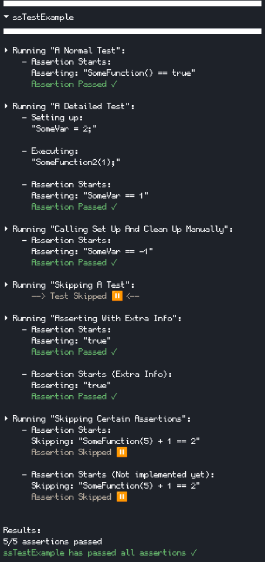

## Usage

Just include the header and then

```c++
#include "ssTest.hpp"

//Our test case
int SomeVar = 0;
bool SomeFunction(){return SomeVar == 1;};
void SomeFunction2(int arg){SomeVar = arg;};

int main()
{
    ssTEST_INIT();      //Initialize ssTest

    ssTEST_SET_UP       //(OPTIONAL) Any setup work
    {
        SomeVar = 1;
    };

    ssTEST_CLEAN_UP     //(OPTIONAL) Any cleanup work
    {
        SomeVar = -1;
    };

    //ssTEST_SET_UP and ssTEST_CLEAN_UP is called between tests
    //Unless ssTEST_DISABLE_CLEANUP_BETWEEN_TESTS(); is called, 
    //then ssTEST_SET_UP and ssTEST_CLEAN_UP will only be called at the beginning and end of all tests
    
    ssTEST("A Normal Test")
    {
        ssTEST_OUTPUT_ASSERT(SomeFunction() == true);
    };
    
    ssTEST("A Detailed Test")
    {
        ssTEST_OUTPUT_SETUP
        (
            SomeVar = 2;
        );
        
        ssTEST_OUTPUT_EXECUTION
        (
            SomeFunction2(1);
        );
        
        ssTEST_OUTPUT_ASSERT(SomeVar == 1);
    };

    ssTEST("Calling Set Up And Clean Up Manually")
    {
        ssTEST_CALL_SET_UP();
        ssTEST_CALL_CLEAN_UP();
        ssTEST_OUTPUT_ASSERT(SomeVar == -1);
    };

    ssTEST_SKIP("Skipping A Test")
    {
        ssTEST_OUTPUT_ASSERT(SomeFunction());
    };

    //If a test fails you can also only run that test with
    //ssTEST_THIS_ONLY("Asserting With Extra Info")
    ssTEST("Asserting With Extra Info")
    {
        ssTEST_OUTPUT_ASSERT(true);
        ssTEST_OUTPUT_ASSERT("Extra Info", true);
    };

    ssTEST("Skipping Certain Assertions")
    {
        //Skipping certain asserts
        ssTEST_OUTPUT_SKIP(SomeFunction(5) + 1 == 2);

        //Skipping certain asserts with extra info
        ssTEST_OUTPUT_SKIP("Not implemented yet", SomeFunction(5) + 1 == 2);
    };

    ssTEST_END();
}
```


