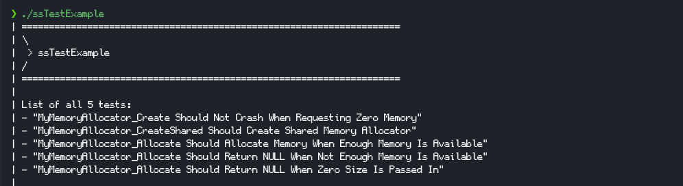
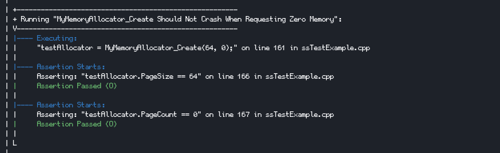
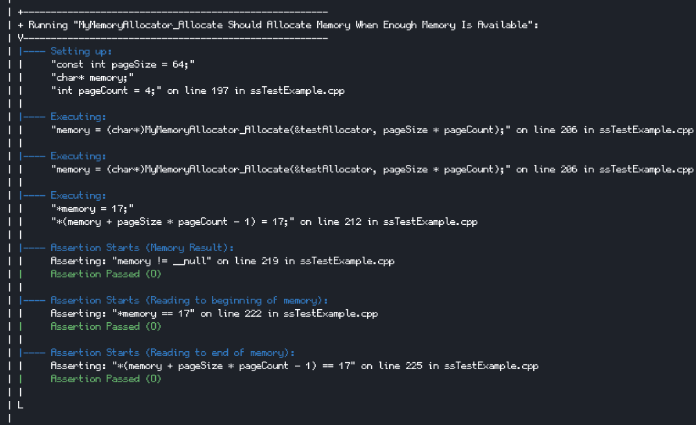
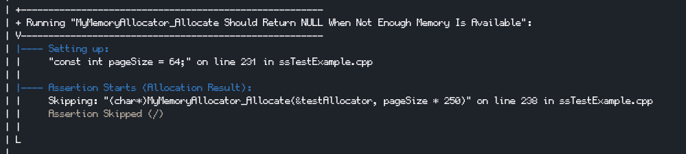

# 🧪 ssTest

An easy to use, flexible, single header, C++11 testing framework.

A testing framework is literally just a fancy way of printing asserts results. 
The last thing you want is to spend so much time trying to figure out how to import and use a testing framework.

## 📦️ Installation

Just include `ssTest.hpp` into your project

## 🏃 Quick Start
Here is a quick example of what ssTest looks like in a simple example. 
Many other features are covered in 📖 [Documentations](#documentations)

```cpp
int AddOne(int input) { return input + 1; }

int main()
{
    int testVar = 0;
    
    //Name of test group is optional
    ssTEST_INIT_TEST_GROUP("ssTest Quick Start");
    
    ssTEST_COMMON_SETUP
    {
        testVar = 1;
    };
    
    ssTEST("testVar Should Be Initialized By Common Setup")
    {
        ssTEST_OUTPUT_ASSERT(testVar == 1);
    };
    
    ssTEST("Setup And Execution Example")
    {
        //ssTEST_OUTPUT_SETUP is optional
        ssTEST_OUTPUT_SETUP
        (
            int testVar2 = 10;
        );
        
        //ssTEST_OUTPUT_EXECUTION is optional
        ssTEST_OUTPUT_EXECUTION
        (
            testVar = AddOne(testVar2);
        );
        
        ssTEST_OUTPUT_ASSERT(testVar == testVar2 + 1);
    };

    ssTEST_END_TEST_GROUP();
}

```

## 📖 Documentations

### 😶‍🌫️ Concepts
In ssTest, **asserts** (`ssTEST_OUTPUT_ASSERT()`) are grouped into **test** (`ssTEST()`), 
**tests** are grouped into **test group** (`ssTEST_INIT_TEST_GROUP()`).

You can also name each assert, test and test group however you want.

Test groups are also nestable so you can have a hierarchy of tests.

<details> 

<summary>So you can have a simple structure like this (Expandable)</summary>

```text
- Test Group: My App
    - Test: Feature A Scenario 1
        - Assert: Action 1
        - Assert: Action 2
    - Test: Feature A Scenario 2
        - Assert: Action 1
        - Assert: Action 2
```

</details>

<details> 

<summary>Or a more complex structure like this (Expandable)</summary>

```text
- Test Group: My App
    - Test: Feature A
        - Test Group: Feature A
            - Test: Feature A Scenario 1
                - Assert: Action 1
                - Assert: Action 2
            - Test: Feature A Scenario 2
                - Assert: Action 1
                - Assert: Action 2
    
    - Test: Feature B
        - Test Group: Feature B
            - Test: Feature B Scenario 1
                - Assert: Action 1
                - Assert: Action 2
            - Test: Feature B Scenario 2
                - Assert: Action 1
                - Assert: Action 2
```

</details>

Each test in a test group can optionally share a **common setup** (`ssTEST_COMMON_SETUP()`) and 
a **common cleanup** function (`ssTEST_COMMON_CLEANUP()`).

### 📂 Test Group

Each test group must be inside a **function that returns an `int`**.

If that test group is successful, it will **return 0**. Otherwise, it will return **non 0**.

It is common to put a single test group in a single `.cpp` file inside the `int main()` function
but you can do any other way you see fit.

#### Initializing A Test Group (Required)
- `ssTEST_INIT_TEST_GROUP();` : Initialize a test group with the name of the current file
- `ssTEST_INIT_TEST_GROUP("testGroupName");`: Initialize a test group with `testGroupName`.

#### Common Setup And Cleanup
> These should be called before declaring the first test (`ssTEST()`) in the test group

- `ssTEST_COMMON_SETUP(){...};`: A common setup function that is called before each test in the test group
- `ssTEST_COMMON_CLEANUP(){...};`: A common cleanup function that is called after each test in the test group
- `ssTEST_DISABLE_COMMON_SETUP_CLEANUP_BETWEEN_TESTS();`: Disable calling the common setup and cleanup functions **between** tests. 
But still be called at the beginning and end of the test group.

#### Ending A Test Group (Required)
- `ssTEST_END_TEST_GROUP();`: Finishes the declarations of all the tests, executes them and outputs the results.

A short example of a test group

```c++
int main()
{
    int testVar = 0;
    int cleanUpCount = 0;
    
    ssTEST_INIT_TEST_GROUP();
    
    ssTEST_COMMON_SETUP{ testVar = 1;};
    ssTEST_COMMON_CLEANUP{ cleanUpCount++; };
    //ssTEST_DISABLE_COMMON_SETUP_CLEANUP_BETWEEN_TESTS();
    
    ssTEST("A Normal Test")
    {
        ssTEST_OUTPUT_ASSERT(testVar == 1);
        testVar = 5;
    };
    
    ssTEST("Another Normal Test")
    {
        ssTEST_OUTPUT_ASSERT(testVar == 1);
        ssTEST_OUTPUT_ASSERT(cleanUpCount == 1);
        
        //If ssTEST_DISABLE_COMMON_SETUP_CLEANUP_BETWEEN_TESTS() is called, 
        //  testVar would be 5 and cleanUpCount would be 0
    };

    ssTEST_END_TEST_GROUP();
}
```

#### Nesting Test Groups (Advanced)

<details>

Just like a normal test group, you just need to call `ssTEST_INIT_TEST_GROUP()` 
inside a function that is called from the outer test group.

However, the (optional) extra step you need to do to make it format well is to pass the indentation
string from the outer test group to the inner test group.

> These should be called before declaring the first test (`ssTEST()`) in the test group
- `ssTEST_GET_NESTED_TEST_GROUP_INDENT();`: Gets the indentation string for nested test group
- `ssTEST_SET_TEST_GROUP_INDENT("indent");`: Sets the indentation level using the string `indent`

Ax example would be

```c++
int AssertGroupA(std::string outerIndent)
{
    ssTEST_INIT_TEST_GROUP("Test Group A");
    ssTEST_SET_TEST_GROUP_INDENT(outerIndent);
    
    ssTEST("A Normal Test In Group A")
    {
        ssTEST_OUTPUT_ASSERT(true);
    };

    ssTEST_END_TEST_GROUP();
}

int main()
{
    ssTEST_INIT_TEST_GROUP("Root Test Group");
    ssTEST("A Normal Test")
    {
        ssTEST_OUTPUT_ASSERT(true);
    };

    ssTEST("Calling A Nested Test Group")
    {
        ssTEST_OUTPUT_ASSERT( AssertGroupA( ssTEST_GET_NESTED_TEST_GROUP_INDENT() ) == 0 );
    };

    ssTEST_END_TEST_GROUP();
}
```

</details>

#### Disable Output For Certain Actions Inside A Test (Advanced)
<details>

> These should be called before declaring the first test (`ssTEST()`) in the test group
- `ssTEST_DISABLE_OUTPUT_SETUP();`: Disable outputting to the console for the test setup action
- `ssTEST_DISABLE_OUTPUT_EXECUTION();`: Disable outputting to the console for the test execution action
- `ssTEST_DISABLE_OUTPUT_ASSERT();`: Disable outputting to the console for the test assert action.
If the assert fails however, it will still output associated line that failed the assert.

</details>

### 🧪 Test

- `ssTEST("testName"){statement_1; statement_2; ...};`: Creates a test with `testName`
- `ssTEST_ONLY_THIS("testName"){statement_1; statement_2; ...};`: Creates a test with `testName` and only runs this test, 
great when debugging a single test.
- `ssTEST_SKIP("testName"){statement_1; statement_2; ...};`: Creates a test with `testName` and skips it

Example:

```c++
int main()
{
    ssTEST_INIT_TEST_GROUP();
    
    ssTEST("A Normal Test")
    {
        ssTEST_OUTPUT_ASSERT(true);
    };
    
    ssTEST_ONLY_THIS("Will Only Run This Test")
    {
        ssTEST_OUTPUT_ASSERT(true);
    };
    
    ssTEST_SKIP("Will Skip This Test")
    {
        ssTEST_OUTPUT_ASSERT(true);
    };
    
    ssTEST_END_TEST_GROUP();
}
```

### 👊 Actions And Assertions Inside A Test

#### Required Assertions
- `ssTEST_OUTPUT_ASSERT(assertionStatement);`: Assert and output the assertion statement.
- `ssTEST_OUTPUT_ASSERT("info", assertionStatement);`: Assert and output the assertion statement with info.
- `ssTEST_OUTPUT_ASSERT("info", assertValue, expectedValue);`: Assert if the `assertValue` and `expectedValue` are 
equal and output result with `info`.
- `ssTEST_OUTPUT_ASSERT("info", assertValue, expectedValue, operator);`: Assert if the `assertValue` 
and `expectedValue` returns true when compared with the `operator` and output result with `info`.

#### Optional Assertions
- `ssTEST_OUTPUT_OPTIONAL_ASSERT(...);`: Execute the assertions with arguments same as "Required Assertions"
but failure of the assertion will **not** fail the test.

#### Test Setup and Execution
- `ssTEST_OUTPUT_SETUP(statement_1; statement_2; ...);`: Executes and output the setup statements.
- `ssTEST_OUTPUT_EXECUTION(statement_1; statement_2; ...);`: Executes and output the execution statements.

#### Skipping Actions
- `ssTEST_OUTPUT_SKIP_ASSERT(...)`: **Skips** the assertion with arguments same as "Required Assertions".
- `ssTEST_OUTPUT_SKIP_SETUP(statement_1; statement_2; ...);`: **Skips** the test setup action.
- `ssTEST_OUTPUT_SKIP_EXECUTION(statement_1; statement_2; ...);`: **Skips** the test execution.

#### Outputting Values (Up to 5 values) When An Assertion Failed
- `ssTEST_OUTPUT_VALUES_WHEN_FAILED(comma, separated, values,...);`: Output the values of the variables when the assertion failed.

#### Calling Common Setup And Cleanup Manually (Advanced)
- `ssTEST_CALL_COMMON_SETUP();`: Calls the common setup function manually
- `ssTEST_CALL_COMMON_CLEANUP();`: Calls the common cleanup function manually

### 📝 Complete Example

Let's say I have a C memory allocator:

```c
//An Example Class To Test
typedef struct
{
    int PageSize;
    int PageCount;
    short* AllocateID_Table;
    int NextAllocateID;
    char* Memory;
} MyMemoryAllocator;

MyMemoryAllocator MyMemoryAllocator_Create(size_t pageSize, size_t pageCount);
bool MyMemoryAllocator_Destroy(MyMemoryAllocator* allocator);
void* MyMemoryAllocator_Allocate(MyMemoryAllocator* allocator, size_t size);
bool MyMemoryAllocator_Free(MyMemoryAllocator* allocator, void* memory);

```

My test file could look like this:

```c++
int main()
{
    MyMemoryAllocator testAllocator;
    
    ssTEST_INIT_TEST_GROUP();

    ssTEST_COMMON_SETUP
    {
        testAllocator = MyMemoryAllocator_Create(64, 12);
    };

    ssTEST_COMMON_CLEANUP
    {
        MyMemoryAllocator_Destroy(&testAllocator);
    };

    ssTEST("MyMemoryAllocator_Create Should Not Crash When Requesting Zero Memory")
    {
        //We want to create our own memory allocator and request empty memory
        ssTEST_CALL_COMMON_CLEANUP();
        
        ssTEST_OUTPUT_EXECUTION
        (
            testAllocator = MyMemoryAllocator_Create(64, 0);
        );
        
        ssTEST_OUTPUT_ASSERT(testAllocator.PageSize == 64);
        ssTEST_OUTPUT_ASSERT(testAllocator.PageCount == 0);
    };
    
    ssTEST("MyMemoryAllocator_CreateShared Should Create Shared Memory Allocator")
    {
        ssTEST_OUTPUT_SETUP
        (
            const int pageSize = 64;
            const int pageCount = 4;
            MyMemoryAllocator sharedAllocator;
            void* sharedMemory = MyMemoryAllocator_Allocate(&testAllocator, 
                                                            pageSize * pageCount + 
                                                            pageCount * sizeof(short));
        );
        
        ssTEST_OUTPUT_EXECUTION
        (
            sharedAllocator = MyMemoryAllocator_CreateShared(sharedMemory, pageSize, pageCount);
        );
        
        ssTEST_OUTPUT_ASSERT(sharedAllocator.AllocateID_Table == (short*)sharedMemory);
        ssTEST_OUTPUT_ASSERT(sharedAllocator.Memory == (char*)sharedMemory + pageCount * sizeof(short));
        ssTEST_OUTPUT_ASSERT(sharedAllocator.PageSize == pageSize);
        ssTEST_OUTPUT_ASSERT(sharedAllocator.PageCount == pageCount);
        
        MyMemoryAllocator_Destroy(&sharedAllocator);
    };

    ssTEST("MyMemoryAllocator_Allocate Should Allocate Memory When Enough Memory Is Available")
    {
        ssTEST_OUTPUT_SETUP
        (
            const int pageSize = 64;
            char* memory;
            int pageCount = 4;
        );
        
        for(int i = 0; i < 2; i++)
        {
            ssTEST_OUTPUT_EXECUTION
            (
                memory = (char*)MyMemoryAllocator_Allocate(&testAllocator, pageSize * pageCount);
            );
        }
        
        ssTEST_OUTPUT_EXECUTION
        (
            *memory = 17;
            *(memory + pageSize * pageCount - 1) = 17;
        );
        
        //This also works without a message as well
        ssTEST_OUTPUT_ASSERT("Memory Result", memory != NULL);
        
        //Asserting by passing two values (to compare equality) will also print the values
        ssTEST_OUTPUT_ASSERT("Reading to beginning of memory", *memory == 17);
        
        //You can also specify the operator to use for comparison
        ssTEST_OUTPUT_ASSERT(   "Reading to end of memory", 
                                *(memory + pageSize * pageCount - 1), 17, ==);
    };
    
    ssTEST("MyMemoryAllocator_Allocate Should Return NULL When Not Enough Memory Is Available")
    {
        ssTEST_OUTPUT_SETUP
        (
            const int pageSize = 64;
        );
        
        //Let's say this is not implemented or we know it is crashing, we can skip the assert 
        //or even skip the whole test with ssTEST_SKIP
        ssTEST_OUTPUT_SKIP_ASSERT(  "Allocation Result", 
                                    (char*)MyMemoryAllocator_Allocate(  &testAllocator, 
                                                                        pageSize * 250) == NULL);
    };
    
    ssTEST("MyMemoryAllocator_Allocate Should Return NULL When Zero Size Is Passed In")
    {
        ssTEST_OUTPUT_SETUP
        (
            char* memory;
        );
        (void)memory;
        
        ssTEST_OUTPUT_EXECUTION
        (
            memory = (char*)MyMemoryAllocator_Allocate(&testAllocator, 0);
        );
        
        //Let's say there's a bug in the allocator which will probably fail the assert, 
        //but we still want to know the result. An optional assert can be used in this case.
        ssTEST_OUTPUT_OPTIONAL_ASSERT("Allocation Result", memory == NULL);
    };

    //etc...

    ssTEST_END_TEST_GROUP();
}
```

For full example, see `Src/ssTestExample.cpp`

Here are some screenshots of the output of the tests







### 📊 Tests And Assert Results

When all the tests have finished running, you can quickly find the ones that failed by searching
for certain keywords from different types of result output.

#### Assertions
- Required Assertions:
    - `Assertion Passed (O)` when passed
    - `Assertion Failed (X)` when failed
    - `Error Caught (X) ...` when an error is caught
- Optional Assertions:
    - `Assertion Passed (+)` when passed
    - `Assertion Failed (-)` when failed
    - `Error Caught (-) ...` when an error is caught
- Skipped Assertions:
    - `Assertion Skipped (/)` when skipped

#### Test
- `...passed all tests (OOO)` when all assertions passed
- `...failed some tests (XXX)` when some assertions failed
- `...Error Caught (XXX)...` when an error is caught

Notice each result has a symbol inside the parentheses, which makes it easier to identify the result.

You can easily capture the symbol inside the parentheses to quickly output the related failures in CI.
For example, if you want the context of all failed asserts, you can quickly do
```bash
cat testResults.txt | grep -B15 "(X)"
```

Or in powershell
```powershell
Select-String -path .\testResult.txt -Pattern "\(X\)" -Context 15,0
```
